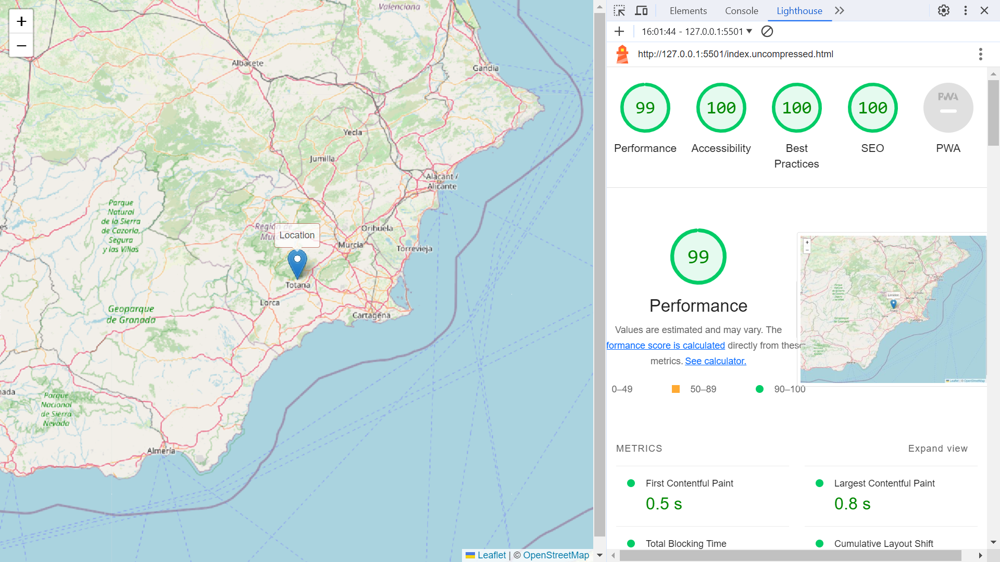

# :zap: HTML CSS Leaflet

* Responsive leaflet.js map in HTML, CSS with code minimised etc. for near-perfect lighthouse score
* **Note:** to open web links in a new window use: _ctrl+click on link_


## :page_facing_up: Table of contents

* [:zap: HTML CSS Leaflet](#zap-html-css-leaflet)
  * [:page\_facing\_up: Table of contents](#page_facing_up-table-of-contents)
  * [:books: General info](#books-general-info)
  * [:camera: Screenshots](#camera-screenshots)
  * [:signal\_strength: Technologies](#signal_strength-technologies)
  * [:floppy\_disk: Setup](#floppy_disk-setup)
  * [:computer: Code Examples](#computer-code-examples)
  * [:cool: Features](#cool-features)
  * [:clipboard: Status \& To-Do List](#clipboard-status--to-do-list)
  * [:clap: Inspiration](#clap-inspiration)
  * [:file\_folder: License](#file_folder-license)
  * [:envelope: Contact](#envelope-contact)

## :books: General info

* Built with HTML, CSS and JavaScript
* Near-Perfect performance, Perfect scores on accessibility, best practices and SEO.
* CSS, HTML and Javascript are minimised to reduce initial render/First Contentful Paint time.

## :camera: Screenshots

.

## :signal_strength: Technologies

* [HyperText Markup Language HTML](https://developer.mozilla.org/en-US/docs/Glossary/HTML)
* [Cascading Style Sheets CSS](https://developer.mozilla.org/en-US/docs/Web/CSS) styling
* [Leaflet.js v1.9.4](https://leafletjs.com/) open-source JavaScript library for mobile-friendly interactive maps. No API key required.
* [JPG to WebP Converter](https://www.freeconvert.com/jpg-to-webp) to create new image formats that result in a higher Lighthouse score
* [PurifyCSS Online](https://purifycss.online/) - remove unused CSS code from your stylesheets
* [Online CSS Minifier Tool and Compressor](https://www.toptal.com/developers/cssminifier)
* [Online JavaScript Minifier Tool and Compressor](https://www.toptal.com/developers/javascript-minifier)

## :floppy_disk: Setup

* Open index.html using [Visual Studio Live Server](https://marketplace.visualstudio.com/items?itemName=ritwickdey.LiveServer). Changes are updated automatically on server.

## :computer: Code Examples

* `scripts.js` code to create Leaflet map tiles based around a point 'pos' in Spain, with a tooltip.

```javascript
// Leaflet Map
var marker;
var pos = L.latLng(37.7964333, -1.5121459);
var map = L.map("map").setView(pos, 8);

L.tileLayer("https://tile.openstreetmap.org/{z}/{x}/{y}.png", {
  maxZoom: 19,
  preload: true,
  formatData: "webp",
  attribution:
    '&copy; <a href="http://www.openstreetmap.org/copyright">OpenStreetMap</a>',
}).addTo(map);

L.marker(pos)
  .bindTooltip("Location", {
    offset: [-15, -8],
    className: "house-tooltip",
    permanent: true,
    direction: "top",
    opacity: 0.75,
    styles: ["background-color: white"]
  })
  .addTo(map);
```

## :cool: Features

* Lighthouse score near-perfect - purified & minimised CSS, minimised JS and HTML files to reduce rendering time.
* Fully responsive.

## :clipboard: Status & To-Do List

* Status: Working.
* To-Do: Is it possible to serve Leaflet tiles as webp to increase Lighthouse score? - it seems that only `.png` tiles are possible now. I was unable to reduce the size of the leaflet CSS file so I stayed with the CDN download.

## :clap: Inspiration

* [Leaflet Usage Example](https://leafletjs.com/reference.html#map-example)

## :file_folder: License

* This project is licensed under the MIT License - see the LICENSE file for details.

## :envelope: Contact

* Repo created by [ABateman](https://github.com/AndrewJBateman), email: `gomezbateman@yahoo.com`
